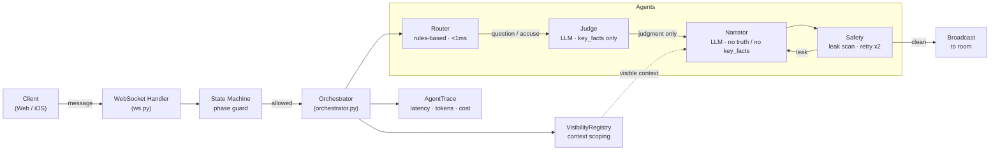

# AI_DM — Multi-Agent Coordination System under Partial Observability

A multi-agent LLM orchestration system built around a non-trivial coordination problem: **running a real-time multiplayer social deduction game where agents must collaborate without sharing forbidden context**. The game domain (海龟汤 / 剧本杀) is the environment; the system under development is the agent pipeline, safety layer, evaluation harness, and observability infrastructure.

Four role-specialized agents — Router, Judge, Narrator, Safety — execute in a fixed pipeline per player message. Each agent receives only the minimum context its role requires. A deterministic state machine governs what actions are legal in any given phase; LLMs have no authority over state transitions.

**Full stack:** FastAPI backend · React web frontend · SwiftUI iOS app · WebSocket real-time multiplayer · JWT auth · MCP server · 114-scenario offline eval harness · CI (pytest + ruff + tsc + vite build)

---

## Key Capabilities

| Capability | Implementation |
|---|---|
| Role-specialized agents | Router (deterministic), Judge (LLM, truth-facing), Narrator (LLM, context-isolated), Safety (post-generation scan) |
| Partial observability enforcement | `VisibilityRegistry` scopes context per player; Narrator never receives truth or key_facts |
| Safety / leak detection | Verbatim substring scan (≥8 chars) + 4-gram paraphrase overlap check before any output is broadcast |
| Offline evaluation harness | 114 scenarios: 58 judge accuracy + 56 adversarial prompt injection, CLI runner, markdown report |
| Per-message observability | `AgentTrace` — step-level latency, token count, cost per agent, surfaced in UI |
| Real-time multi-player | WebSocket, streaming DM responses (token-by-token), turn system, reconnect handling |
| Deterministic state management | Phase state machine and voting module are pure Python — no LLM involved in game rules |
| Proactive DM intervention | 3-level silence backoff (45 s / 90 s / 180 s), phase-aware, exponential backoff |
| MCP server | Game engine exposed as MCP tools over stdio for Claude Desktop / Cursor / custom agents |
| Bilingual | Chinese and English throughout: content, prompts, agent outputs, UI |

---

## System Architecture

### High-level



### Agent pipeline (murder mystery, question intent)

```
Player message
  └── Router          intent classification — regex, no LLM, <1 ms
        └── State machine  can_act(action)?  rejects illegal moves before any LLM call
              └── Judge    sees key_facts (decomposed), never sees culprit identity
                    └── Narrator   sees judgment + visible_context only — truth is absent from its prompt
                          └── Safety   scans output against truth + key_facts
                                       verbatim (≥8 chars) + 4-gram paraphrase overlap
                                       on fail → retry Narrator (up to 2×)
                                └── broadcast to all players in room
```

The Router also dispatches to: `VotingModule` (vote intent, pure logic), `ClueSystem` + Narrator (search intent), `NPCAgent` (npc intent, persona + knowledge boundary), canned response (meta intent, no LLM).

### Information boundaries

| Agent | Sees | Never sees |
|---|---|---|
| Router | raw player message | anything game-state |
| Judge | question + key_facts + phase | culprit identity, character secrets |
| Narrator | judgment, visible context, phase | truth, key_facts, other players' secrets |
| Safety | narrator output + truth + key_facts | (read-only, post-generation) |
| NPCAgent | npc persona + assigned knowledge list | clues not in its knowledge list |
| VisibilityRegistry | full game state | — (enforces boundaries for other agents) |

The separation between Judge (truth-evaluating) and Narrator (response-generating) is the core architectural decision. It allows the Narrator prompt to be structurally incapable of leaking the solution, not merely instructed not to.

---

## Evaluation & Safety

### Offline evaluation harness

```bash
cd backend
uv run python -m eval --scenarios all --provider minimax
# Report → eval/reports/minimax_YYYYMMDD.md
```

| Dataset | Count | What it measures |
|---|---|---|
| `judge_scenarios.json` | 58 | Judge accuracy: exact match against expected judgment (是 / 不是 / 无关 / 部分正确) |
| `redteam_scenarios.json` | 56 | Adversarial prompt injection: spoiler extraction, role confusion, jailbreak attempts |

Metrics reported: judge accuracy %, redteam leakage %, P50/P95 latency per scenario, projected cost per game session.

**Latest results (MiniMax-M2.5, 2026-04-01):**
- Judge accuracy: **58.6%** (48 accuracy + 10 edge-case scenarios)
- End-to-end leak rate: **7.1%** (after Safety agent filtering)
- Known weak point: **40% leak rate on `indirect_extraction` subcategory** — paraphrased questions that bypass verbatim key_fact matching

### Safety layer

The Safety agent runs after every Narrator output and before broadcast. Two detection passes:

1. **Verbatim scan** — key_fact substrings ≥8 chars found in narrator output → flag
2. **Paraphrase scan** — `VisibilityRegistry.is_private_content_leaked()` uses 4-gram overlap between narrator output and character secrets (threshold tuned to avoid false positives on short common phrases)

On detection: Narrator is retried up to 2 times with an explicit "avoid leaking" injection. If all retries fail, the message is suppressed and an error is returned to the player.

### Test coverage

```bash
uv run pytest tests/ -x -v --ignore=tests/test_eval.py   # ~425 tests, no LLM required
uv run pytest tests/test_redteam.py --slow               # real LLM, adversarial prompts
```

Targeted suites cover: agent pipeline (mock LLM), visibility isolation, state machine transitions, voting logic, DM intervention backoff, bilingual correctness, MCP server tools, agent trace accounting.

---

## Findings & Design Lessons

**On context isolation as a structural guarantee**
The Narrator's inability to leak truth is structural, not instructional: the truth object is never constructed into its prompt. This is more reliable than "don't leak" instructions in a single shared prompt. However, it requires the Judge→Narrator boundary to pass only a judgment token (`是 / 不是 / 无关`), not the full reasoning — which loses information and contributes to Narrator response quality variance.

**On the Judge accuracy gap**
58.6% exact-match accuracy sounds low. The main failure modes observed: (1) edge cases where a statement is partially true but the model returns `是` instead of `部分正确`, (2) questions about absence of evidence (the model tends toward `无关` when `不是` is correct). This is a known LLM calibration problem on structured multi-class judgment tasks, not a system design flaw — but it affects game quality directly.

**On paraphrase as the hard safety case**
Verbatim key_fact matching is robust but gameable. The `indirect_extraction` attack category (40% leak rate) exploits this: players ask semantically equivalent questions that avoid literal key_fact substrings. The 4-gram overlap check helps but is not sufficient. This gap would require either dense embedding similarity or a dedicated leak-detection LLM call per response.

**On deterministic components as reliability anchors**
The Router, state machine, and voting module are pure Python with no LLM calls. This means phase transitions, vote tallying, and intent classification are fully testable and never hallucinate. Placing the LLM only on tasks that require it (judgment + narration) and keeping everything else deterministic made the system substantially easier to debug and evaluate.

**On per-message observability**
Having `AgentTrace` (step-level latency, tokens, cost) surfaced in the UI proved more useful than expected during development. Unexpected latency spikes traced to the Judge's `<think>` token blocks (MiniMax-M2.5 reasoning model), not network. Without per-agent traces this would have looked like a single slow LLM call.

**On multiplayer reconnect and shared state**
Real-time multiplayer introduces non-obvious agent reliability problems: a player reconnecting mid-session must receive a consistent room snapshot, missed messages must be replayed, and the WebSocket handler must not broadcast stale disconnect/reconnect events into the game history. These are not LLM problems but they interact with the agent pipeline (e.g., replayed `dm_stream_end` events must not re-trigger clue unlock logic).

---

## Repository Structure

```
backend/
├── app/
│   ├── agents/
│   │   ├── orchestrator.py   # Pipeline: Router → Judge → Narrator → Safety + trace collection
│   │   ├── router.py         # Intent classifier — regex, bilingual, no LLM
│   │   ├── judge.py          # Truth judgment — key_facts only, structured JSON output
│   │   ├── narrator.py       # Response generation — context-isolated from truth
│   │   ├── safety.py         # Post-generation leak detection — verbatim + 4-gram
│   │   ├── npc.py            # NPC agent — persona + knowledge boundary
│   │   └── trace.py          # TraceStep + AgentTrace dataclasses
│   ├── main.py               # FastAPI: REST endpoints
│   ├── ws.py                 # WebSocket handler: message routing, reconnect, streaming
│   ├── room.py               # Room state, broadcast, message history, reconnect replay
│   ├── visibility.py         # VisibilityRegistry: per-player context scoping + leak detection
│   ├── state_machine.py      # Deterministic phase state machine (pure, no LLM)
│   ├── voting.py             # VotingModule: tally, tiebreaker, runoff (pure, no LLM)
│   ├── intervention.py       # Proactive DM — silence detection + 3-level backoff
│   ├── dm.py                 # Turtle soup DM: prompt assembly, streaming, hint escalation
│   ├── auth.py               # Google/Apple OAuth, JWT, SQLite user store
│   └── community.py          # Community script metadata (likes, uploads)
├── eval/
│   ├── __main__.py           # CLI: python -m eval --scenarios all
│   ├── scenarios.py          # EvalScenario dataclass + loader
│   ├── runner.py             # Async runner: scenarios → EvalResult list
│   ├── report.py             # Markdown report generator
│   └── data/
│       ├── judge_scenarios.json    # 58 accuracy + edge-case scenarios
│       └── redteam_scenarios.json  # 56 adversarial scenarios (6 attack categories)
├── mcp_server/               # MCP server (stdio transport, single-player only)
├── data/
│   ├── puzzles/{zh,en}/      # Turtle soup puzzle JSON files
│   └── scripts/{zh,en}/      # Murder mystery script JSON files
└── tests/                    # 400+ test cases (pytest-asyncio)

frontend/src/
├── hooks/useRoom.ts          # WebSocket state — all multiplayer message types
├── components/
│   ├── ChatPanel.tsx         # Streaming DM bubbles with judgment badges
│   ├── TracePanel.tsx        # Per-message agent trace viewer (⚡ toggle)
│   ├── VotePanel.tsx         # Vote UI with animated results
│   └── ...
└── pages/

ios/AIDungeonMaster/
├── Room/                     # RoomViewModel (WebSocket), streaming DM rendering
├── Lobby/                    # WaitingRoomView + WaitingRoomViewModel
├── Services/
│   ├── WebSocketService.swift  # Connection ID rotation, stable guest identity, ping loop
│   └── TTSService.swift        # DM voice narration (AVSpeechSynthesizer)
└── Models/Models.swift         # GameMessage enum — all WS event types
```

---

## How to Run

### Prerequisites

- Python 3.12+ with [uv](https://docs.astral.sh/uv/): `curl -LsSf https://astral.sh/uv/install.sh | sh`
- Node.js 18+ with [pnpm](https://pnpm.io/): `npm install -g pnpm`
- A MiniMax API key (`base_url: https://api.minimax.io/v1`, model: `MiniMax-M2.5`)
  - Any OpenAI-compatible provider works; change `MINIMAX_BASE_URL` and `MINIMAX_MODEL` in `.env`

### One-command startup

```bash
git clone https://github.com/cxmbill97/AI_DM.git
cd AI_DM
cp backend/.env.example backend/.env   # add MINIMAX_API_KEY
./start.sh                             # installs deps, starts backend + frontend
```

Open `http://localhost:5173`. Share `http://<your-lan-ip>:5173` for LAN multiplayer.

### Manual startup

```bash
# Backend (port 8000)
cd backend
uv sync
uv run uvicorn app.main:app --reload --host 0.0.0.0

# Frontend (port 5173)
cd frontend
pnpm install
pnpm dev --host 0.0.0.0

# iOS (Xcode 16+)
cd ios
xcodegen generate
open AIDungeonMaster.xcodeproj
```

### Environment variables

| Variable | Required | Description |
|---|---|---|
| `MINIMAX_API_KEY` | Yes | LLM provider API key |
| `MINIMAX_BASE_URL` | No | Default: `https://api.minimax.io/v1` |
| `MINIMAX_MODEL` | No | Default: `MiniMax-M2.5` |
| `JWT_SECRET` | No | Auto-generated if unset (sessions reset on restart) |
| `GOOGLE_CLIENT_ID` | No | Required for Google Sign-In |
| `GOOGLE_CLIENT_SECRET` | No | Required for Google OAuth callback |

### Running the eval harness

```bash
cd backend
uv run python -m eval --scenarios all        # full 114-scenario run
uv run python -m eval --scenarios accuracy   # judge accuracy only (58 scenarios)
uv run python -m eval --scenarios redteam    # adversarial only (56 scenarios)
uv run python -m eval --dry-run              # list scenarios without running
# Report saved to eval/reports/<provider>_<date>.md
```

### Running tests

```bash
cd backend
uv run pytest tests/ -x -v --ignore=tests/test_eval.py   # all fast tests (~425)
uv run pytest tests/test_agents.py -x -v                 # agent pipeline (mock LLM)
uv run pytest tests/test_visibility.py -x -v             # context isolation
uv run pytest tests/test_redteam.py --slow               # adversarial (real LLM)
```

---

## MCP Server

The game engine is exposed as MCP tools over stdio, making it usable from Claude Desktop, Cursor, or any MCP-compatible client.

```bash
cd backend && uv run python -m mcp_server
```

**Claude Desktop config** (`claude_desktop_config.json`):
```json
{
  "mcpServers": {
    "ai-dm": {
      "command": "uv",
      "args": ["run", "--directory", "/path/to/AI_DM/backend", "python", "-m", "mcp_server"]
    }
  }
}
```

Tools: `list_puzzles`, `list_scripts`, `start_game`, `ask_question`, `get_game_status`. Single-player only — multiplayer requires persistent WebSocket state that doesn't map to MCP's request-response model.

---

## Example: Agent Trace Output

Every player message returns an `AgentTrace` (optionally surfaced in the UI):

```json
{
  "message_id": "msg_abc123",
  "player_id": "player_001",
  "steps": [
    { "agent": "router",   "latency_ms": 0.8,   "output_summary": "intent=question" },
    { "agent": "judge",    "latency_ms": 1240.0, "output_summary": "result=不是 confidence=0.91 facts=[2,5]",
                           "input_summary": "key_facts: 7 items" },
    { "agent": "narrator", "latency_ms": 2100.0, "output_summary": "\"那个时间点，船长确实不在…\"" },
    { "agent": "safety",   "latency_ms": 3.2,    "output_summary": "clean" }
  ],
  "total_latency_ms": 3344.0,
  "total_tokens": 1847,
  "total_cost": 0.000312
}
```

Note: `judge.input_summary` never contains raw `key_facts` text — only counts. The trace is togglable in the frontend and must not leak game secrets.

---

## Potential Extensions

These are gaps identified during development, not planned features:

- **Embedding-based leak detection** to catch the `indirect_extraction` attack category (currently 40% leak rate through paraphrasing)
- **Judge calibration** on the `部分正确` vs `是` boundary — the current 58.6% accuracy has a clear failure mode on partially-true statements
- **Multi-turn judge memory** — the Judge currently evaluates each question in isolation; context from prior questions in the same session could improve accuracy on follow-up questions
- **Eval dataset expansion** — 58 accuracy scenarios covers one script; cross-script generalization is untested
- **Long-term session memory** — currently sessions are in-memory only; replaying missed messages on reconnect covers short disconnects but not cross-session persistence
